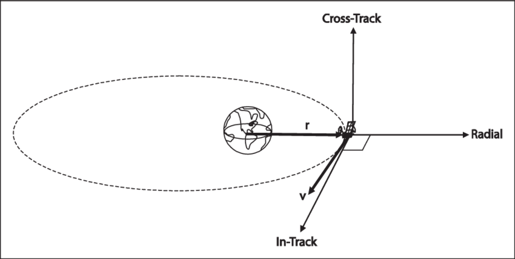
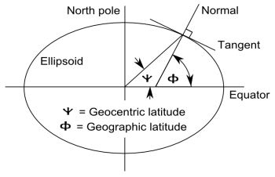
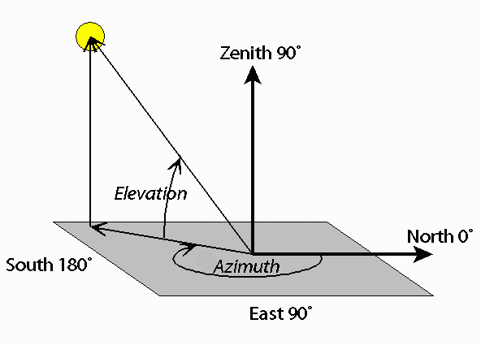

Data
========

This contains explanations on the physics concepts behing the columns.

relative_speed
^^^^^^^^^^^^^^
The vector difference between the velocities of two bodies. The velocity of a body with respect to 
another regarded as being at rest. This can be understood at how fast is the chaser object coming at
the target.

relative_position
^^^^^^^^^^^^^^^^^
Similar to relative speed. 

Cross track, radial and transverse (along-track)
^^^^^^^^^^^^^^^^^^^^^^^^^^^^^^^^^^^^^^^^^^^^^^^^

The three different dimensions to consider.

Geocentric latitude
^^^^^^^^^^^^^^^^^^^
The angular distance between a point on the Earth's surface and the equator, using the center of the Earth as the vertex. 
It differs from geodetic latitude in that it accounts for the ellipsoidal shape of the Earth rather than considering it as a perfect sphere. 

Azimuth & Elevation
^^^^^^^^^^^^^^^^^^^
Azimuth and Elevation are measures used to identify the position of a satellite flying overhead. Azimuth tells you what direction to face 
and Elevation tells you how high up in the sky to look. Both are measured in degrees

F10: 10.7 cm radio flux index [10−22 W/(m2 Hz)]
^^^^^^^^^^^^^^^^^^^^^^^^^^^^^^^^^^^^^^^^^^^^^^^
The solar radio flux at 10.7 cm (2800 MHz) is an excellent indicator of solar activity. Often called the F10.7 index, it is one of the longest 
running records of solar activity. The F10.7 radio emissions originates high in the chromosphere and low in the corona of the solar atmosphere. 
The F10.7 correlates well with the sunspot number

AP: daily planetary geomagnetic amplitude index
^^^^^^^^^^^^^^^^^^^^^^^^^^^^^^^^^^^^^^^^^^^^^^^
The daily average Ap index, which monitor the Earth's magnetic field.
The Ap index ranges from 0 (very quiet) to 400 (extremely disturbed). An Ap index of 30 or greater indicates local geomagnetic storm conditions.

SSN: Wolf sunspot number
^^^^^^^^^^^^^^^^^^^^^^^^
Quantity that measures the number of sunspots and groups of sunspots present on the surface of the Sun.